# terraDial

Standalone control panel for the **terraPen** pen plotter, running on an
Elecrow CrowPanel 1.28" round display — a 240×240 touchscreen with a rotary
knob. It talks to [FluidNC](http://wiki.fluidnc.com/) over a WebSocket, so
the plotter can be driven from the bench without a laptop or phone.

Parent project: [terraForge](https://github.com/theworkisthework/terraForge)
(the desktop app this panel descends from — and the source of its colour
palette). Sibling: terraPixel (the rail lighting controller this panel can
also drive).

## What it does

- **Jog** X/Y/Z by knob, with selectable step sizes and a per-axis *Set zero*
- **Run G-code** straight off the plotter's SD card, with live progress,
  elapsed time and an estimate of the time remaining — including for jobs
  started from terraForge or the web UI rather than the panel
- **Pen up/down**, **homing** (with a clear-the-bed confirmation), **E-Stop**
  and **alarm clear**, the last showing FluidNC's own reason for the alarm
- **Rail lighting** control via terraPixel — brightness, film mode, comet width
- **On-device Wi-Fi setup**: scan for networks, pick one, type the password
- **Machine status** shown on the panel's 5-LED ring, readable across the room
- **Sleep mode** so the panel isn't glowing at you through a multi-hour plot,
  with the terraPen mark shown while idle beforehand
- **About screen** carrying the project identity and QR links to the site,
  source and Discord — a 240px dial is no place to read a URL

## Screens

> These are **vector illustrations, not photographs.** They're generated by
> [`tools/gen_screens.py`](tools/gen_screens.py) from the real layout values —
> palette hex, ring radii, arc angles, hub and font sizes — so proportions and
> colours match the firmware, but icons are simplified stand-ins for LVGL's
> symbol font and the panel's actual anti-aliasing isn't reproduced.

| | | |
|:--:|:--:|:--:|
| 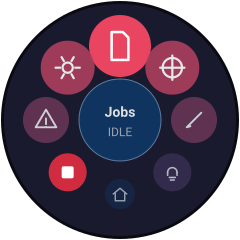<br>**Home** — 9 destinations, E‑Stop always red | 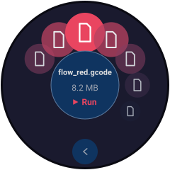<br>**Jobs** — SD files on an open arc | 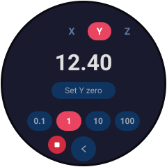<br>**Jog** — axis, position, per‑axis zero |
| 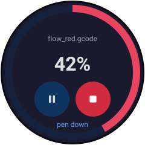<br>**Job progress** — elapsed, and time left | 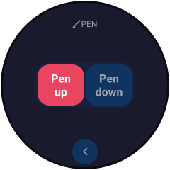<br>**Pen** — up / down | <br>**Home XY** — clear‑the‑bed gate |
| 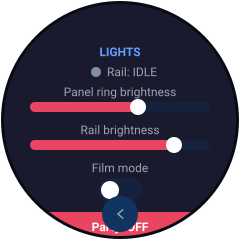<br>**Lights** — terraPixel rail control | 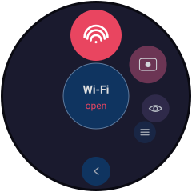<br>**Settings** — four categories | 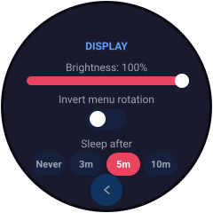<br>**Display** — brightness, sleep |
| 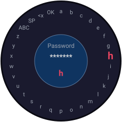<br>**Radial keyboard** — knob‑first text entry | 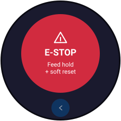<br>**E‑Stop** — feed hold + soft reset | 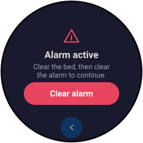<br>**Alarm clear** — appears on alarm |
| 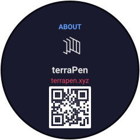<br>**About** — identity, QR links, diagnostics | 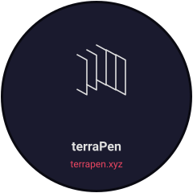<br>**Idle** — the mark, before sleep | |

## Hardware

| | |
|---|---|
| Board | Elecrow CrowPanel 1.28" Rotary (ESP32-S3R8, 16MB flash, 8MB PSRAM) |
| Display | GC9A01 240×240 round IPS, SPI |
| Touch | CST816D capacitive, I²C |
| Input | EC11-style rotary encoder with push switch |
| LEDs | 5× WS2812 ring around the bezel |

Pin assignments are in [`include/pins.h`](include/pins.h), confirmed against
Elecrow's factory example for this exact board rather than guessed.

### Power

It's a **USB-powered device** — a single USB-C lead carries both power and,
when you want it, the serial console and firmware flashing. There's no barrel
jack and no separate supply to find.

That also means it runs happily off a **USB battery pack**, which is handy for
a plotter that isn't parked next to a socket, or for filming without a cable
in shot. Two things worth knowing if you do:

- Many power banks cut out when they stop seeing meaningful current draw.
  This panel is a modest load to begin with, and screen sleep drops it further
  by switching the backlight off entirely — so a bank with an aggressive
  auto-shutoff may power down mid-plot. Banks with a "low-current" or
  "trickle" mode avoid this; otherwise turn sleep off (Settings → Display)
  when running from one.
- The bezel LED ring draws on the same supply, so a high ring brightness
  costs battery life directly. It's on the Lights screen if you want it down.

Enclosure files (`dial case.stl`, `frame mount.stl`, `backplate.dxf`) are in
the repo root.

## Building

Built with [PlatformIO](https://platformio.org/).

```bash
# 1. Wi-Fi credentials and hostnames -- secrets.h is gitignored
cp include/secrets.h.example include/secrets.h
$EDITOR include/secrets.h

# 2. Build and flash
pio run -t upload

# 3. Watch the logs
pio device monitor
```

Only the SSID and password are compile-time *defaults*: they're seeded into
NVS on first boot, after which the Settings screen can change networks
on-device without a reflash.

## Using it

The knob is the primary input; touch works everywhere too.

| Gesture | Does |
|---|---|
| Rotate | Move through a ring / jog the selected axis / scroll a settings panel |
| Click | Open the highlighted item, or confirm |
| Long press | Back (out of a category first, then out of the screen) |
| Tap the centre hub | Open whatever the hub is naming |

**Home** is a radial dial of nine destinations, ordered the way a session
actually runs rather than by category — Home XY, Jog, Pen, Jobs, Progress,
E-Stop, Alarm, Lights, Settings. The ring rests on the first of them, so the
first thing under the selection when the panel wakes is the first thing you
do. **Jobs** and **Settings** use the same ring on an open arc, which keeps
the bottom of the face clear of the back button.

Job Progress and Alarm Clear also appear on their own when a job starts or an
alarm trips. Progress is a dial item as well as an automatic one: that's how
you get back to a running job after wandering off to change the lights.

E-Stop stays red at every position on the dial rather than only when
selected, so it's findable at a glance.

## Layout

```
docs/screens/    README illustrations (generated)
include/         pins, palette, LVGL config, shared enums
lib/CST816D/     vendor touch driver
src/
  config/        NVS-backed settings
  display/       all UI screens and shared widgets
  input/         encoder driver
  led/           WS2812 status ring
  net/           FluidNC WebSocket client, terraPixel HTTP client, Wi-Fi
tools/           icon, logo and screen-illustration generation
design_handoff_radial_dial_ui/   the original design brief (historical)
```

Some notes worth knowing before changing things:

- **Networking runs on core 0**, in its own task (see `networkTask` in
  `main.cpp`). mDNS lookups, WebSocket reads and HTTP calls all block for
  seconds at a time; running them in `loop()` stalls rendering and touch.
  Commands travel UI→network through a queue, and **nothing outside that task
  may touch LVGL** — LVGL is single-threaded and lives on core 1.
- **It's a round screen.** Anything more than ~120px from centre (120,120) is
  behind the bezel and physically unreachable, corners included. Several bugs
  have come from laying out against the 240×240 square instead of the circle.
- **Avoid `transform_zoom` / `lv_img_set_zoom` on anything whose parent has
  opacity < 255.** That combination pushes LVGL down an offscreen-layer path
  that is unreliable on this board — it has twice caused elements to render
  blank or vanish. Change real sizes instead.
- Colours come from [`include/palette.h`](include/palette.h), ported from
  terraForge's dark theme. Use the tokens, not literal hex.
- **The dial's order lives in three places** and they must agree:
  `DIAL_ITEMS` in `ui_dial.cpp`, the positional `switch` in `ui_nav.cpp`'s
  `onDialOpen()`, and the `screen_home()` item list in `tools/gen_screens.py`.
  Reordering one alone doesn't fail to build — it just quietly sends every
  item to the wrong screen.
- **Pace what you send FluidNC.** Commands are queued and the whole queue is
  drained in one pass, so two lines enqueued together hit the wire
  microseconds apart. `$X` immediately followed by `$H` used to alarm the
  machine on any home after the first; `home()` now unlocks only when there's
  actually an alarm and holds the `$H` until that has landed. For the same
  reason jogging is refused mid-homing — the jog-cancel realtime byte would
  stop the cycle, and FluidNC alarms on a homing cycle that didn't finish.
- Project links live in [`include/branding.h`](include/branding.h). The
  Discord URL is deliberately empty until there's a real invite — an entry
  with no URL is skipped rather than rendered as a QR that goes nowhere.

## Licence

MIT — see [LICENSE](LICENSE). Same licence as its parent project
[terraForge](https://github.com/theworkisthework/terraForge).
